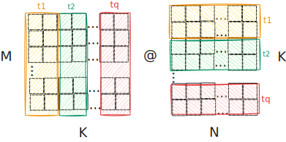

# gemm
Step by step matrix multiplication optimization for educational purposes.

## CPU

We want to multiply a matrix $\boldsymbol{A}$ of shape $m \times k$ with matrix $\boldsymbol{B}$ of shape $k \times n$ and get matrix $\boldsymbol{C}$ of shape $m \times n$.

### 1. Naive 
Naive 3-loop iterative implementation.

*Not the most naive*, as it does calculate the dot-product for an element $\boldsymbol{C}_ {i,j}$ in a variable (which likely is stored in a single register) and doesn't read memory at each $\boldsymbol{C}_ {i,j}$ update in the iterative summing. This makes it such that the CPU cache is not polluted with useles reads for $\boldsymbol{C}$ thus havig more space elements of $\boldsymbol{A}$ and $\boldsymbol{B}$ matrices.

### 2. Cache friendly loop reordering

Data is transferred between memory and cache in blocks of fixed size, called cache lines or cache blocks. When a cache line is copied from memory into the cache, a cache entry is created. The cache entry will include the copied data as well as the requested memory location (called a tag).

The usual size of a cache line is `64` bytes, meaning it will read `16` contiguous fp32s at a time. `getconf -a | grep CACHE` to see exact numbers for cache sizes and cache line sizes. 

On a high level, when the processor needs to read or write a location in memory, it first checks for a corresponding entry in the cache. The cache checks for the contents of the requested memory location in any cache lines that might contain that address. If the processor finds that the memory location is in the cache, a cache hit has occurred. However, if the processor does not find the memory location in the cache, a cache miss has occurred. In the case of a cache hit, the processor immediately reads or writes the data in the cache line. For a cache miss, the cache allocates a new entry and copies data from main memory, then the request is fulfilled from the contents of the cache.

As a rough estimation of order of magnitude, an L1 cache reference takes ~1ns, whereas main memory reference takes ~100ns.

When calculating the value of element $\boldsymbol{C}_ {i,j}$ we calculate the dot-product between $\boldsymbol{A}_ {i,:}$ (i-th row of $\boldsymbol{A}$) and $\boldsymbol{B}_ {:,j}$ (j-th column of $\boldsymbol{B}$).

Given the strided representation of matrices in memory, and the fact that C is a row-major programming language, it means that the inner loop (to $k$) from the Naive implementation is very cache unfriendly.
For matrix $\boldsymbol{A}$, $k$ represents columns (i.e. contiguous memory), but for matrix $\boldsymbol{B}$ it represents rows.
When iterating over matrix $\boldsymbol{B}$ (going down the rows), the memory read always cache-misses (assuming $\boldsymbol{B}$ is large enough, i.e. roughly $\boldsymbol{B}$'s row stride > cache line).

We can re-order the loops and swap the $k$ loop with the $n$ loop. $n$ loop indexes into the columns of matrix $\boldsymbol{B}$ and we would benefit a lot, cache wise, if that would be done most frequently. 
Now the innermost loop computes partial results, hence we cannot perform accumulation in a single register anymore.

#### O2 vs O3
We see a big performance increase either way, as the loops are now a bit more friendly to the CPU cache.

Interestingly though, on my machine, there is a **HUGE** difference between compiling with `-O2` and `-O3`. The compiler produces very different asm code.

Performance wise for 1024x1024 matrices:
* with `O2`,  I get an average of `9.54` GFLOP/s from 50 runs, which is **12.8** times faster than the naive version.
* with `O3` however, I get an average of `75.22` GFLOP/s!!. This is **101.6** times faster than the naive version and **7.8** times faster than the same actual code, but compiled with `-O2`.

##### Deep dive into the generated assembly code

> objdump -d build/obj/cpu/kernels/loop_reorder.o 

`O2` seems to use AVX SIMD instructions for the calculations. It doesn't use any FMA (fused multiply-add) instructions.

It only uses `xmm` registers (i.e., 128bit/4 FP32s at a time). So no `ymm` (256bit/8 FP32s) or `zmm` (512bit/16 FP32s).

Uses just the scalar AVX ops (i.e., `vmulss`, `vaddss`, `vmovss`), which only work on a single floating-point of a `xmm` register, so it's not really taking advantage of SIMD parallelism.

```
...
100:   c5 f2 59 21             vmulss (%rcx),%xmm1,%xmm4
104:   48 83 c0 04             add    $0x4,%rax
108:   48 83 c1 04             add    $0x4,%rcx
10c:   c5 da 58 60 fc          vaddss -0x4(%rax),%xmm4,%xmm4
111:   c5 fa 11 60 fc          vmovss %xmm4,-0x4(%rax)
...
```

Also, the `O2` variant doesn't unroll the loops automatically, this can be forced with `-funroll-loops` though. 
Adding `-funroll-loops` to the `O2` variant seems to net us a consistent extra `0.7` GFLOP/s. From ~`9.5` to about `10.2`.

The assembly code generated with `O3` is far more complicated. It looks to have unrolled everything with the idea of improving cache coherency and also taking advantage of SIMD instructions. Interestingly enough, it still doesn't use FMA instructions.

One core part to note is that it seems to do to packed muls (`vmulps`) and adds (`vaddps`) on `zmm` registers. (i.e., does calculations on 16 FP32s pairs in parallel).
```
3a0:   62 d1 6c 48 59 44 15    vmulps 0x0(%r13,%rdx,1),%zmm2,%zmm0  
3a7:   00                                                                         
3a8:   62 f1 7c 48 58 04 10    vaddps (%rax,%rdx,1),%zmm0,%zmm0
3af:   62 f1 7c 48 11 04 10    vmovups %zmm0,(%rax,%rdx,1)     
3b6:   48 83 c2 40             add    $0x40,%rdx     
3ba:   48 39 d3                cmp    %rdx,%rbx                
3bd:   75 e1                   jne    3a0 <sgemm_loop_reorder+0x3a0>
```

### 1-D Tiling
Another optimization technique we can try, that might help with cache locality is called tiling (or blocking). 

The idea behind tiling is to divide the matrices into smaller sub-matrices, called tiles, that are more likely to fit into the CPU caches offering better cache coherency for the dot products.

Instead of iterating over the entire rows and columns of $\boldsymbol{A}$ and $\boldsymbol{B}$, 
we perform multiplication on corresponding tiles.

As a starting point we will tile only on one dimension -- across the columns of $\boldsymbol{A}$ and across the rows of $\boldsymbol{B}$.

Formally, let's assume arbitrary tile size $t$. We can split $k$ into $q=\frac{k}{t}$ tiles.

We can divide $\boldsymbol{A}$ into $q$ tiles across the columns (i.e., each tile $\boldsymbol{A}_ {i}$ will have shape $m \times t$). Analoguous, we can divide $\boldsymbol{B}$ into $q$ blocks across the rows (i.e., each tile $\boldsymbol{B}_ {i}$ will have shape $t \times n$).



Each tile multiplication iteration will partially update the full $\boldsymbol{C}$ matrix.
Formally, the full $\boldsymbol{C}$ matrix is computed as follows:
```math
\boldsymbol{C} = \sum_ {i=1}^{q} \boldsymbol{A}_ {i} \boldsymbol{B}_ {i}
```

For small size matrices (e.g. 1024x1024), the performance is quite similar (although the tiling version is consistently better) to the `O3` optimized loop reordering version. 

However, for bigger size matrices (2048/4096) they diverge. The 1D tiling version seems to be better by wider margins.

The performance of the loop reordering version, seems to drop off a lot for bigger dimensions.
My assumption is that for the loop reordering version, the compiler makes some assumptions about the dimensionality of the input and optimizes for cache coherency, based on those assumptions.
The tiling version seems to be better for the general case (i.e. arbitrary sized matrices).

I empirically found the best performing tile size to be `64` on my system. Although, more educated guesses could be made based on the caches specifications. My caches specifications:

> getconf -a | grep CACHE
```
LEVEL1_ICACHE_SIZE                 32768
LEVEL1_ICACHE_ASSOC                
LEVEL1_ICACHE_LINESIZE             64
LEVEL1_DCACHE_SIZE                 49152
LEVEL1_DCACHE_ASSOC                12
LEVEL1_DCACHE_LINESIZE             64
LEVEL2_CACHE_SIZE                  1048576
LEVEL2_CACHE_ASSOC                 16
LEVEL2_CACHE_LINESIZE              64
LEVEL3_CACHE_SIZE                  33554432
LEVEL3_CACHE_ASSOC                 16
LEVEL3_CACHE_LINESIZE              64
```

### Results

Hardware:
* **CPU** AMD Ryzen 7 9700X 8 Core @ 5.5GHz (at max)
* **RAM**: 64GB DDR5 @ 4.8GHz
* **OS**: Ubuntu 24.04
* **Compiler**: clang 18.1.3
* **Compiler flags** (i.e., `FAST=1 make build`): `-O3 -march=native`

Experiment:
* 50 runs each. Used the mean GFLOPs/s
* Single thread only
* `OpenBLAS` was manually limited to one thread by running with `OMP_NUM_THREADS=1`. It's a lot faster (~10x), if we let it utilize all the cores.

#### 1024x1024 matrices

| **Kernel** 	                     | **GFLOP/s**  | **Speed-up over naive**     |**Performance relative to OpenBLAS** |
|------------------------------------|:------------:|:---------------------------:|:-----------------------------------:|
| [1] Naive      	                 |`0.74`        |`1.0x`                       |`0.4%`                               |
| [2] Cache friendly loop reordering |`75.22`       |`101.6x`                     |`44.9%`                              |
| [3] 1-D Tiling (t=64)              |`77.99`       |`105.3`                      |`46.5%`                              | 
| [0] OpenBLAS  	                 |`167.48`      |`226.3x`                     |`100%`                               |

#### 2048x2048 matrices

| **Kernel** 	                     | **GFLOP/s**  | **Speed-up over naive**     |**Performance relative to OpenBLAS** |
|------------------------------------|:------------:|:---------------------------:|:-----------------------------------:|
| [1] Naive      	                 |`0.47`        |`1.0x`                       |`0.3%`                               |
| [2] Cache friendly loop reordering |`65.04`       |`138.3x`                     |`38.7%`                              |
| [3] 1-D Tiling (t=64)              |`77.76`       |`165.4x`                     |`46.3%`                              | 
| [0] OpenBLAS  	                 |`167.69`      |`226.3x`                     |`100%`                               |

#### 4096x4096 matrices

> Not including the Naive version, as it's not providing any value for these dimensions (and it takes long to run).

| **Kernel** 	                     | **GFLOP/s**  |**Performance relative to OpenBLAS** |
|------------------------------------|:------------:|:-----------------------------------:|
| [2] Cache friendly loop reordering |`26.73`       |`16.1%`                              |
| [3] 1-D Tiling (t=64)              |`64.98`       |`39.3%`                              | 
| [0] OpenBLAS  	                 |`165.06`      |`100%`                               |


### How to replicate?
#### 1. Prereqs
Requires [`OpenBlas`](https://github.com/OpenMathLib/OpenBLAS) to be installed in order to check CPU kernels corectness and compare number of FLOPS against.

Make sure to have it installed somewhere where `pkg-config` can access it.

e.g.
```bash
git clone https://github.com/OpenMathLib/OpenBLAS 
cd OpenBLAS                                   
make -C .                                    
make -C . PREFIX=/usr/local install          
```

#### 2. Build
```bash
make build
```

If non standard `OpenBlas` installation path: 
```bash
OPENBLAS_PATH=<path> make build
```

#### 3. Run
Creates matrices with random values (normally distributed with mean 0 and variance 1) of dimensions `m x k` and `k x n`. Uses kernel with id `i` to multiply them. Calculates the mean
GFLOP/s of all the runs.
```
./build/gemm -i <kernel-id> -m <m value> -n <n value> -k <k value>
```

## References
Extremely well written articles which I highly recommend reading:
1. https://marek.ai/matrix-multiplication-on-cpu.html
2. https://siboehm.com/articles/22/Fast-MMM-on-CPU
3. https://siboehm.com/articles/22/CUDA-MMM
